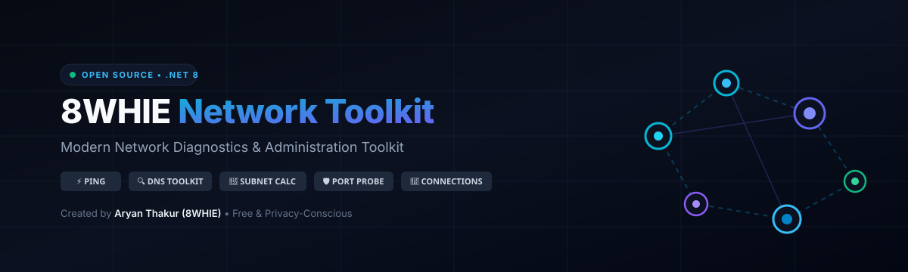

# 8WHIE Network Toolkit (8NWT)

<p align="center">
  
</p>

<p align="center">
  <strong>Modern Network Diagnostics &amp; Administration Toolkit</strong><br>
  <em>A free, open-source, privacy-conscious Windows application bringing essential network discovery, troubleshooting, and administration utilities into one modern interface.</em>
</p>

<p align="center">
  <a href="https://github.com/8WHIE/network-toolkit/actions"></a>
  <a href="LICENSE"></a>
  <a href="https://dotnet.microsoft.com/download/dotnet/8.0"></a>
  <a href="PRIVACY.md"></a>
  <a href="https://www.youtube.com/@8WHIE"></a>
</p>

---

## ⚡ About The Project

**8WHIE Network Toolkit** is an independently crafted Windows desktop application designed specifically for network engineers, system administrators, IT students, developers, home-lab enthusiasts, and cybersecurity students who operate exclusively on authorized networks.

Built from the ground up with clean-room, original C# / .NET architecture and MVVM patterns, it consolidates diagnostic commands (Ping, Traceroute, DNS, Port Probe, Subnet Calculations, Connection Monitoring, Routing, Wi-Fi Inspection, and Remote Tool Launching) into an intuitive, high-performance desktop interface with full dark/light theme support.

### 🌟 Project Identity & Brand
- **Project Brand**: 8WHIE
- **Creator & Maintainer**: Aryan Thakur
- **YouTube**: [https://www.youtube.com/@8WHIE](https://www.youtube.com/@8WHIE)
- **Instagram**: [@imarykt](https://instagram.com/imarykt)
- **Telegram**: [@arnxkt](https://t.me/arnxkt)
- **GitHub**: [8WHIE](https://github.com/8WHIE)

---

## 🛠️ Key Modules & Features

| Module | Description |
| :--- | :--- |
| **📊 Dashboard** | Real-time overview of active network adapter, IPv4/IPv6, default gateway, DNS servers, MAC address, current link status, and internet latency health card. |
| **🌐 Network Information** | Deep inspection of local adapters, interface speeds, DHCP status, MTU, operational states, and one-click JSON/CSV export. |
| **⚡ Ping Diagnostics** | Configurable packet counts, timeouts, intervals, real-time jitter/loss metrics, min/avg/max latency calculation, and probe visualization. |
| **🛤️ Traceroute** | Step-by-step route visualization with per-hop latency, reverse DNS resolution, and destination arrival detection. |
| **🔍 DNS Toolkit** | Query A, AAAA, MX, TXT, NS, CNAME, SOA, and PTR records with custom DNS resolver support, TTL inspection, and timing metrics. |
| **🔢 IP & Subnet Calculator** | Instant calculation of Network IP, Broadcast, Host Min/Max, Usable Hosts count, Subnet Mask, Wildcard Mask, Binary IP & Mask breakdown, Class, and CIDR cheat-sheet. |
| **🛡️ Safe Port Connectivity** | Defensive TCP connectivity testing for authorized target hosts/ports. Open, closed, filtered, and timeout status reporting with response times. |
| **📡 Local Network Discovery** | Safe discovery of devices on authorized local subnets with hostname, MAC, vendor identification, and clear authorization disclaimers. |
| **🔌 Active Connections View** | Real-time listing of active TCP and UDP sockets from Windows IP table with local/remote endpoints, TCP state, and process details. |
| **🗺️ Windows Routing Table** | Interface route viewer displaying Destination, Netmask, Gateway, Interface IP, Metric, and route classification. |
| **📶 Wi-Fi Details** | Detailed wireless connection metrics including SSID, BSSID, RSSI dBm, signal percentage, Channel, Band (2.4/5/6 GHz), 802.11 standards, and WPA security status. |
| **💻 Remote Tools Hub** | Quick administrative launcher and command generator for Remote Desktop (mstsc.exe), SSH, PowerShell remoting, and network utilities. |
| **📁 Profiles Manager** | Save hostnames, IP addresses, custom port lists, notes, and environment labels (Production, Staging, HomeLab, Cloud) with safe local storage. |
| **📜 Structured Logs** | Chronological diagnostic logging with log levels (INFO, WARN, ERROR, DEBUG), component tags, search, and export. |
| **⚙️ Preferences & Privacy** | Dark/Light themes, configurable timeouts, custom DNS resolver, offline mode toggle, and zero telemetry guarantee. |

---

## 🔒 Privacy & Defensive Security

### Privacy-First Promise
1. **Zero External Telemetry**: 8WHIE Network Toolkit never transmits user network topology, IP addresses, or diagnostic logs to external analytics servers.
2. **Local Processing**: All calculations (subnetting, routing inspection, socket listing) are executed directly on your Windows machine using native APIs.
3. **No Credential Harvesting**: The toolkit does not extract or store cleartext passwords, Wi-Fi keys, or sensitive credentials.
4. **Offline Operational Mode**: The app operates fully without an active internet connection for closed air-gapped lab networks.

### Responsible Use Policy
This software is intended strictly for authorized educational, administrative, and defensive diagnostic purposes. Users must test and probe only hosts and networks they own or have received explicit written permission to administer.

---

## 🚀 Installation & Requirements

### System Requirements
- **Operating System**: Windows 10 (version 1809 or higher), Windows 11, or Windows Server 2019+
- **Architecture**: x64, ARM64
- **Runtime**: [.NET 8.0 Desktop Runtime](https://dotnet.microsoft.com/download/dotnet/8.0) or higher

### Building from Source

```bash
# 1. Clone the repository
git clone https://github.com/8WHIE/network-toolkit.git
cd network-toolkit/dotnet

# 2. Restore NuGet dependencies
dotnet restore EightWhie.NetworkToolkit.sln

# 3. Build the solution in Release configuration
dotnet build EightWhie.NetworkToolkit.sln -c Release

# 4. Run the xUnit test suite
dotnet test tests/EightWhie.NetworkToolkit.Tests/EightWhie.NetworkToolkit.Tests.csproj

# 5. Publish single-file self-contained executable (optional)
dotnet publish src/EightWhie.NetworkToolkit/EightWhie.NetworkToolkit.csproj -c Release -r win-x64 --self-contained true -p:PublishSingleFile=true
```

---

## 📂 Project Structure

```text
network-toolkit/
├── .github/
│   └── workflows/
│       ├── build-and-test.yml        # Continuous Integration (build, test, artifact)
│       └── codeql-analysis.yml       # Automated security scanning
├── assets/
│   ├── banner.svg                    # Vector artwork & branding
│   └── logo.svg                      # Official 8WHIE icon
├── docs/
│   ├── WINDOWS_TROUBLESHOOTING.md   # Practical guide for IT sysadmins
│   ├── SUBNET_CALCULATOR_GUIDE.md    # CIDR & bitmask calculations
│   ├── DNS_DIAGNOSTICS.md           # DNS record troubleshooting
│   ├── PORT_ANALYSIS.md              # Defensive TCP probe techniques
│   └── REMOTE_TOOLS.md               # Administrative launcher guides
├── dotnet/
│   ├── EightWhie.NetworkToolkit.sln  # Visual Studio Solution
│   ├── src/
│   │   └── EightWhie.NetworkToolkit/
│   │       ├── EightWhie.NetworkToolkit.csproj
│   │       ├── App.xaml / App.xaml.cs
│   │       ├── MainWindow.xaml / MainWindow.xaml.cs
│   │       ├── Models/              # Domain models (NetworkModels.cs)
│   │       ├── Services/            # Subnet, Ping, Traceroute, Windows API
│   │       ├── ViewModels/          # MVVM ViewModels
│   │       └── Themes/              # WPF Dark/Light Theme Styles
│   └── tests/
│       └── EightWhie.NetworkToolkit.Tests/
│           ├── EightWhie.NetworkToolkit.Tests.csproj
│           ├── SubnetCalculatorTests.cs
│           └── ExportAndProfileTests.cs
├── CODE_OF_CONDUCT.md
├── CONTRIBUTING.md
├── LICENSE                           # MIT License
├── PRIVACY.md                        # Privacy manifesto
├── README.md
└── SECURITY.md                       # Security policy
```

---

## 🗺️ Roadmap

- [x] High-performance IPv4/CIDR Subnet Calculator with binary representation
- [x] Multi-probe Ping engine with jitter and packet loss statistics
- [x] Step-by-step Traceroute with reverse DNS
- [x] DNS query engine supporting A, AAAA, MX, TXT, NS, CNAME, SOA, PTR
- [x] Defensive TCP Port connectivity probe with service detection
- [x] Windows adapter & IPGlobalProperties socket connection viewer
- [x] Wi-Fi adapter signal & band inspection
- [x] Export to CSV, JSON, and formatted TXT reports
- [ ] IPv6 Subnet Calculator & EUI-64 address generator
- [ ] Wake-on-LAN (WOL) magic packet transmitter
- [ ] Automated network latency baseline comparison reports
- [ ] Packet capture integration via standard Windows ETW / pktmon

---

## 🤝 Contributing

Contributions are welcome! Please review [CONTRIBUTING.md](CONTRIBUTING.md) and [CODE_OF_CONDUCT.md](CODE_OF_CONDUCT.md) before opening pull requests or filing issues.

---

## 📄 License

This project is licensed under the **MIT License** — see the [LICENSE](LICENSE) file for details.

---

## 🌐 Community & Author Links

Created and maintained by **Aryan Thakur (8WHIE)**:

- 📺 **YouTube**: [youtube.com/@8WHIE](https://www.youtube.com/@8WHIE)
- 📸 **Instagram**: [@imarykt](https://instagram.com/imarykt)
- 💬 **Telegram**: [@arnxkt](https://t.me/arnxkt)
- 🐙 **GitHub Organization**: [github.com/8WHIE](https://github.com/8WHIE)

*Copyright © 2026 8WHIE. All rights reserved.*
